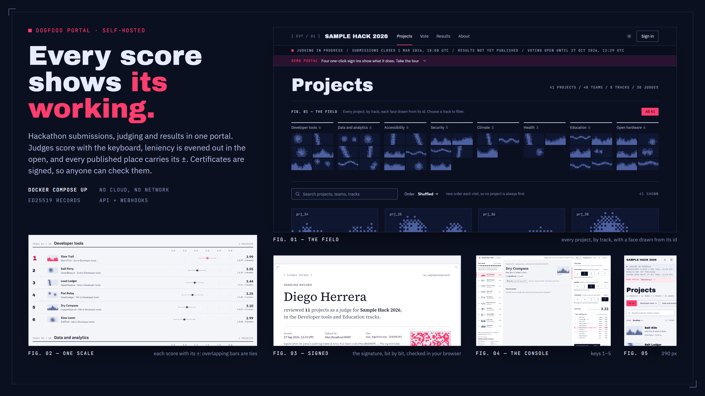

# Dogfood portal



A self-hostable hackathon submission and judging portal, built for Dogfood 2026.
Every score, average and rank on its screens can be traced to how it was reached.

## Run it

```bash
docker compose up
```

Wait for the line `portal ready: http://localhost:8080/events/sample-hack-2026`
(Next.js prints its own "Ready" a moment earlier, before the database is seeded).
The first start imports `fixtures.json` and prints four `Cookie: session=...`
headers for the acceptance checker; they are the same on every start.
`docker compose down -v` resets everything.

No network is needed at run time. The image build downloads npm packages once.

To look around, open `/sign-in`: while `SEED_CHECKER_SESSIONS=true` it offers
one-click demo sign-ins as the organizer (Demo Organizer), two judges (Diego
Herrera, Jonas Vogel) and a participant.

### A five-minute tour

1. Sign in as the organizer. The **Overview** lists the three decisions that
   stand between the sample event's scores and published results: a judge who
   scored every project 4 / 4 / 4, a project entered twice, and a project left
   with one counted review. Each shows its evidence and is settled by one
   audited action, with a written reason wherever it overrides a rule.
2. **Results** shows the ranking and its working: open any project for its
   receipt (each review, the judge's leniency, the arithmetic, the change from
   the raw mean, the ± of the score). Below it, the **judge ledger** gives every
   judge's leniency ± error and what leaving that judge out would move, before
   you decide.
3. The community vote is open in demo mode, for 30 days from the first start:
   signed in as anyone, pick up to three favourites at
   `/events/sample-hack-2026/vote`, or open the link the start prints
   (`community vote (demo): ...`) in a private window. The organizer's **Voting**
   tab shows the count live; everyone else sees it only when the vote closes.
   A ballot through the open link shows in its own column and changes no place:
   the demo, like a new event, does not add open-link ballots to the result.
4. Settle the decisions and publish. Publishing also closes the community vote,
   so nobody votes with the judged ranking in view; its count goes public with
   the results. `/events/sample-hack-2026/results` shows each place with its
   score ± error; signed in as the participant, **My project** shows the team
   its reviews and a signed certificate, which `/verify` checks.
5. Sign in as a judge: the keyboard-first console shows only that judge's own
   scores; asking the API for another judge's is refused with 403.
6. **Audit log** lists every change and every request refused to a signed-in
   user (up to 60 per person in 10 minutes), with the hash chain's head; **Integrations** has webhooks, the `fixtures.json` export and a link
   to your API tokens; `/api-docs` is the API reference.
7. Pairwise judging, on a fresh start (`docker compose down -v && docker compose
   up`) or any time before you publish: as the organizer, **Settings**, "How
   judges judge", choose Pairwise and give a reason. Sign in as a judge: the
   console now asks "which is better?" about two projects at a time; answer with
   ← and →, try **T** (too close to call) and **U** (undo). Back as the
   organizer, **Results** shows the pairwise ranking: each project's win % with
   its ±, the chance it is ahead of the next place, and its receipt.

## Check it

```bash
python run.py .dogfood.toml
```

The organizers' suite covers T1 and T2 only; asked on Discord, the admin
souvlakee answered in #ask-everything on 2026-09-25 at 07:33 UTC: "T3 and T4 are
judged by hand so judges review your code, UI, and architecture directly." So run.py prints
"claimed but not verified" for T3 and T4 by design. Our hand check for role
isolation and every T3 and T4 bullet is `tests/isolation_check.py` (Section C, for
T4 and pairwise judging (C9), is `tests/isolation_t4.py`; standard library only, plus Node for the offline
record check when it is installed). It writes votes and comments and publishes the
sample event's results, so run it on a fresh instance after run.py:

```bash
python tests/isolation_check.py .dogfood.toml
```

Its output from a clean `docker compose down -v && docker compose up` is committed
as `isolation-report.txt`. Our own tests (`npm ci && npm test`, vitest, on Node 24
like the image: passwords use its built-in argon2) cover the permission
rules, the assignment engine, the normalization engine and its Monte Carlo
validation, the pairwise engine and its Monte Carlo proof, voting and comments, the audit log's append-only triggers and hash
chain, and the triggers that keep published results final.

How it is built: `ARCHITECTURE.md` (a request's path through the one permission
check, the audit log, boot, the API) and `DATA-MODEL.md` (every table, its
constraints and what personal data it keeps). How judging works and why:
`JUDGING.md`. What the portal stops and what it does not (vote stuffing, collusion,
deadline gaming and more): `THREAT-MODEL.md`.

## Beyond the checker

Every T3 and T4 bullet from the event site, what exists, and how to check it by
hand. Paths assume the seeded event, `sample-hack-2026` (id `evt_01`).

| Tier | Bullet | Status | Where | Hand check |
|---|---|---|---|---|
| T3 | Community voting: email gated, link based or authenticated | Built | Organizer: Voting tab. Voters: `/events/sample-hack-2026/vote`, `/vote/<code>` | `isolation_check.py` B1, B3, B4, B6. In demo mode the sample event's vote is open from the first start (tour step 3). Email gated means a voter list by address with one personal link each; the portal sends no mail, the organizer sends the links |
| T3 | Project comments | Built | Each project page; `GET/POST /api/projects/<id>/comments` | B8: post, organizer hides with a reason, the reason stays in place |
| T3 | Results hidden during the voting window | Built | `GET /api/events/evt_01/community`, `GET /api/events/evt_01/voting` | B2, B5: while the window is open the public count is `null` for everyone and live only for organizers (403 for a participant); B10 after. The judged results never show during the vote either: publishing closes it (vitest, `publishing ends the community vote`) |
| T3 | Randomized project ordering on ballots | Built | Each voter's ballot, seeded per voter | B4: two ballots, two different orders |
| T3 | Anti abuse: rate limits, duplicate detection, audit trail | Built | Limits on ballots, link entries, comments, sign-in; no signed-in vote for your own team's project; one ballot per person the portal can name; the open link's ballots counted apart, added to the result only if the organizer chose that before the first ballot; flags on the organizer's Voting tab; the audit log | B3 (an own-project pick is 422), B5 (also the open link counted apart, and the choice fixed once ballots are in: 409), B7, B9 (429 with `Retry-After`), B10 (the open link's ballot apart in the closed count), B12 (every step is in the audit log) |
| T4 | REST API and webhooks | Built | A JSON route for every action in the interface (a test holds every form and button to one), through the same data access layer and permission checks; OpenAPI 3.1 at `/api/openapi.json`, readable at `/api-docs`; the session cookie, or a named API token (made at `/account/tokens`, revocable, acting with its owner's permissions) as `Authorization: Bearer <token>`. Webhooks on the organizer's Integrations tab: any audited action (ballot picks, scores and pairwise answers left out), queued in the same transaction as the change, signed `Dogfood-Signature: t=…,v1=<HMAC-SHA256>`, retried with backoff, with a delivery log | `isolation_check.py` C1 to C3. By hand: `curl -H "Authorization: Bearer <token>" localhost:8080/api/events/sample-hack-2026/overview`, where `<token>` is the part after `session=` on the organizer line of `.dogfood.toml` (a session token works as a Bearer too): 200; with the participant's token 403; with no header 401. To watch a webhook arrive: set `WEBHOOKS_ALLOW_PRIVATE: "true"` in docker-compose.yml (local targets are refused otherwise) and run `docker compose up -d` again, add a webhook on Integrations with the URL `http://host.docker.internal:9911/`, run `node scripts/webhook-receiver.mjs --secret <the secret it shows>` on your machine and press "Send a test": each delivery prints with `signature: valid` (Linux needs one more line, in the script's header) |
| T4 | Certificate and record generation | Built | After publishing: a certificate for each member of a submitting team (podium places and a community-vote win on it) and a record for each judge, at `/records/<id>`, printable. Organizers issue them all on the Results tab; people can fetch their own from their project page or the judge console | C4 publishes over the API and issues them. By hand: publish the sample event (Overview: make the three decisions, then Publish), then Results tab, "Issue every record", and open one |
| T4 | Signed, publicly verifiable judge participation records | Built | Ed25519 over the record's canonical JSON; the public key at `/.well-known/dogfood-keys.json` (open to any site); checked in the browser with WebCrypto on each record page and on `/verify`, by `POST /api/records/verify`, or offline with `node scripts/verify-record.mjs <record URL or file> [--keys <saved key file>]` | C4 (a changed record is `bad_signature`), C5 (the script: exit 0, then 1 for the changed copy). By hand: download a record, change one letter, paste it into `/verify`: "Not valid" from the browser and the portal |
| T4 | Embeddable gallery widget | Built | `<script src="http://localhost:8080/embed.js" data-event="sample-hack-2026" async></script>`; the frame is `/embed/sample-hack-2026` | C6. By hand: put the snippet in an `.html` file and open it in a browser (from disk or any site): the gallery appears and sizes itself. `curl -sI localhost:8080/embed/sample-hack-2026` shows `frame-ancestors * file:`; every other page answers `frame-ancestors 'none'` |
| T4 | Bulk import and export | Built | Export at every stage: scores, projects, normalized ranking and audit log as CSV, `event.json`, and `fixtures.json` in the organizers' own fixture format. Import: an administrator uploads such a file on Your events (or `POST /api/imports`), through the same idempotent importer the portal boots with; a file for an event already here adds to it only for that event's organizers and never once its results are published, and ids another event holds are renamed, never shared; people who come in that way get personal links to set a password (Integrations tab) | C7 (export, then an import that changes nothing), C8 (a new event imported and one person walked in by a personal link). By hand: export `fixtures.json` from the Integrations tab, import it on a fresh portal: the same tables and a byte-identical `normalized.csv`, as long as no decision has been made (`tests/import-claims.test.ts` does exactly this) |

## What it does

- **Events and teams.** An administrator creates an event with dates, tracks,
  prizes, custom questions and a weighted rubric. People sign up, form a team,
  share an invite link (until the deadline a member can leave, and the captain
  can take a member off or hand the captaincy over), draft and edit a project
  until the deadline (name,
  tagline, description, repository, demo video and live links, a thumbnail, an
  image gallery, tech tags, the track and the organizer's questions); the server
  refuses changes after it. The public gallery shows every submitted project,
  searchable (tags included) and filterable by track.
- **Judging.** The organizer invites judges by link (no mail server needed) and
  assigns projects with a seeded, stored assignment run; judges score in a
  keyboard-first console with autosave and see only their own scores. The
  organizer's overview shows progress live and lists the decisions that must be
  made before results can go out: a flat judge, a duplicate entry, an
  under-reviewed project. Scores are normalized for judge leniency with a method
  documented and defended in `JUDGING.md`, and each project's normalized
  score comes with its receipt, judge by judge: the change from the raw mean and
  a ± of one standard error. A judge ledger shows each judge's leniency ± error
  and, before any override, what leaving that judge out would move.
- **Pairwise judging (optional).** An organizer can have judges answer "which
  is better?" instead of scoring: the switch is on Settings, audited, with a
  reason. Judges see two of their own projects at a time, may call it too close,
  and place each project into their own order in about log₂ n answers, with the
  arrow keys. The ranking is a Bradley-Terry fit of every answer, with the pull
  of the left side and of the project just opened measured and taken out; each
  place carries its chance of really being ahead of the next, each project a
  receipt of the comparisons behind it, and scores given before the switch still
  count as the order they imply. Judges whose answers look like coin flips are
  flagged for the organizer to settle before publishing. The method, its limits
  and its Monte Carlo proof are in `JUDGING.md`, "Pairwise mode".
- **Results and exports.** Publishing is locked until every decision is made; it
  stores the exact normalization run it publishes. Teams then see their place,
  their score with its ±, and each review's feedback, judges unnamed. CSV exports (scores,
  projects, normalized ranking, audit log) and a full `event.json` are available
  at every stage.
- **Community vote and comments.** The organizer opens a voting window and chooses
  who may vote: signed-in accounts, a voter list with personal links, and/or an
  open link. The open link's ballots are counted apart, in their own column, and
  add to the result only if the organizer chose that before the first ballot. Each ballot lists the projects in the voter's own shuffled order; the
  count is live for organizers only while the window is open, public when it
  closes, and final from then on. Publishing the results closes an open vote
  (and calls off one not yet open), so nobody votes with the ranking in view. Suspected duplicate ballots are flagged while voting is open, for an
  audited set-aside; ballots, link entries, comments
  and sign-in are rate limited. Signed-in visitors can comment on projects, and an
  organizer can hide a comment with a reason that stays in its place.
- **Signed certificates and judging records.** Once results are published, each
  team member can get a certificate and each judge a record of their judging,
  signed with the portal's Ed25519 key. Anyone holding one can check it: on its
  page (the browser verifies the signature itself), on `/verify`, or offline with
  `scripts/verify-record.mjs`. The key is made at first start and kept in the
  database; back the database up (below) to keep it.
- **API and webhooks.** Everything the interface does is also a JSON route,
  documented at `/api-docs` and as OpenAPI 3.1 at `/api/openapi.json`.
  Its request bodies come from the server's own validators, and a test fails if
  a route is missing from it or it lists a method and path no route answers.
  Scripts use named API tokens that act with
  their owner's permissions and cannot make more tokens. Webhooks send any
  audited action to your URL (ballot picks, scores and pairwise answers left
  out: who acted and when, never the values), signed with
  HMAC-SHA256 and retried with backoff; each delivery is written in the same
  transaction as the change, so none is lost or invented.
- **Import and export.** Every stage exports as CSV (the download buttons add a
  UTF-8 byte-order mark so Excel reads accented names; the API adds it only with
  `?bom=1`), and a whole event as
  `event.json` or as `fixtures.json`, the organizers' own fixture format, which
  an administrator can import into another portal to get the same projects,
  judges and scores, and the same ranking as before any decision (settings and
  the organizer's decisions stay in `event.json`). Imported people get into their accounts through one-time personal
  links the organizer sends.
- **Audit log.** Every change, and every request refused to someone signed in
  or holding a voting link, is recorded in the same transaction as the change
  (past 60 refusals in 10 minutes a person gets 429 and no row, so the log
  cannot be flooded). Each event's entries are on its Audit log tab; the
  entries no event owns (accounts, sign-ins, API tokens, the signing key,
  demo mode) are on Your events, Portal log, for administrators; both are in
  the API (`GET /api/events/{event}/audit`, `GET /api/audit`); the database refuses edits and deletes of the log,
  and each row carries the hash of the one before.

## Running it for a real event

On a fresh volume, set these in `docker-compose.yml` and start it:

```yaml
      SEED_CHECKER_SESSIONS: "false"
      FIXTURES_PATH: "none"
      ADMIN_EMAILS: "you@example.org"
      DOGFOOD_SEED_SECRET: "a long random string of your own"
      PUBLIC_URL: "https://hack.example.org"
      COOKIE_SECURE: "true"
```

The portal starts without the sample event and prints, in its own log, a
one-time link: `administrator setup: open https://hack.example.org/sign-up?setup=...`.
Open it and sign up with the address in `ADMIN_EMAILS`: that account is an
administrator, and on **Your events** it creates your event (dates, tracks,
prizes, rubric) or imports one from a `fixtures.json`-format file. Judges and
teams join through the links the portal gives you; co-organizers sign up and you
add them by their email on the event's **Settings** tab (an account that already
has a place in an event you do not run is added only by the administrator). Someone who forgets
their password asks you: on **Accounts** (next to Portal log) you make a
one-time link for their address, which works once, within a day, and signs
that account out everywhere when the new password is set. Accounts are not
email-verified, so the address alone proves nothing: without the setup link a
sign-up with a named address is refused, and an account that already exists is
never promoted, so name an address that has no account yet.

Why `SEED_CHECKER_SESSIONS: "false"`: the checker's four
session tokens are public in `.dogfood.toml`. They are derived from
`DOGFOOD_SEED_SECRET`, whose default (`dogfood-2026-public-demo-secret`) is
documented on purpose; set your own when the flag is on anywhere public. The
portal enforces that: with the flag on, the default secret and a `PUBLIC_URL`
that is not a local address, it refuses demo mode and says so at start. With
the flag off, each start also signs out every session the demo sign-in buttons
made, takes the demo organizer's administrator rights, and ends what anyone
acting as a demo identity handed out: their API tokens are revoked, their
webhooks turned off, their unused account and password reset links deleted and
their open judge invites revoked. So turning demo mode off works on a volume that ran with it
on. The
same secret salts the hashes of voters' network addresses (`DATA-MODEL.md`,
"Privacy"), so a real event sets its own in any case.

| Setting (environment, in `docker-compose.yml`) | What it does |
|---|---|
| `SEED_CHECKER_SESSIONS` | `"true"` seeds the checker's four sessions and the demo sign-in buttons; `"false"` for a real event (boot then removes any left from before) |
| `DOGFOOD_SEED_SECRET` | Derives the checker sessions, salts the voters' address hashes and seals the signing key in the database; set your own, and keep it: under a new one the portal starts a new signing key (records signed before still verify) |
| `PUBLIC_URL` | The address people use (for example `https://hack.example.org`): it goes into the reminder messages for judges, the API reference, the embed code, and every signed record as its issuer, so set it before issuing records. Links made on screen (invitations, voter and claim links) use the address in the organizer's browser |
| `COOKIE_SECURE` | `"true"` marks every cookie `Secure`; set it when the portal is served over HTTPS |
| `TRUST_PROXY_HOPS` | How many reverse proxies stand in front of the portal, each appending to `X-Forwarded-For` (usually `1`). Unset, the client address is the connection's own and any `X-Forwarded-For` a client sends is ignored; set it only when that many proxies really are in front, or a client can name its own address |
| `WEBHOOKS_ALLOW_PRIVATE` | `"true"` lets webhooks reach private and local addresses; leave it unset unless the receiver is on your own network |
| `ADMIN_EMAILS` | Addresses (comma separated) for the portal's administrators, who create and import events. Each signs up through the one-time setup link the portal prints in its log at start; a link works once, and each start prints a new one while a named address has no account yet. The sign-up's audit row records it |
| `DATABASE_PATH`, `FIXTURES_PATH` | Where the database lives (default `/data/portal.db`, in the volume) and which fixture file each start imports (idempotently: rows already there are left as they are); `"none"` starts without the sample event |

`docker-compose.yml` publishes the portal on `127.0.0.1:8080` only; put it behind
a reverse proxy that terminates HTTPS, and set `TRUST_PROXY_HOPS` (see the
next section).

Back up while it runs, with SQLite's online backup; the copy lands in the volume:

```bash
docker compose exec portal node scripts/backup.mjs
```

It prints the file's path, for example `/data/backups/portal-20260927T013000Z.db`;
`docker compose cp portal:/data/backups/portal-20260927T013000Z.db .` copies it
out. To restore, stop the portal, put the file back in the volume, and let the
restore script replace the database and drop the old write-ahead log (copying
the file over by hand would let SQLite replay that log onto it):

```bash
docker compose stop
docker compose cp ./portal-20260927T013000Z.db portal:/data/restore.db
docker compose run --rm --no-deps portal node scripts/restore.mjs /data/restore.db
docker compose start
```

Upgrading is `git pull` and `docker compose up --build`: migrations run at every
start, and the fixture import never overwrites what the organizers changed.

## What it does not do yet

- Thumbnails and gallery images are links to images on the team's own host; the
  portal stores no uploaded files. They load from that host, without a referrer,
  and a card falls back to its generated picture when one does not load.
- Webhook targets on private or local addresses are refused, when added and at
  every delivery (`WEBHOOKS_ALLOW_PRIVATE=true` lifts that for a receiver on the
  same machine), but a host name whose DNS answer changes between the check and
  the request is not caught. Webhook secrets are kept in the database as they
  are, because the portal signs with them.
- No email: invitations, voter links, personal links for imported people,
  password reset links and reminders are links the organizer or administrator
  copies and sends. Accounts are not email-verified. A forgotten password is
  reset only by a portal administrator's one-time link, never by an event's
  organizer. An organizer's personal links for imported people reach only
  people who hold no role and no team seat in any event that organizer does
  not run (checked again when a link is used), and making someone a
  co-organizer follows the same rule, so one event's organizer cannot take
  over accounts that matter in another; anyone else waits for the
  administrator's reset link.
- The per-address limits (open-link entries; sign-ups and sign-ins) and the
  duplicate-ballot flags key on the client's network address, so people behind
  one address (an office, a venue's wifi) share a limit.
- Results cannot be unpublished from the interface.
- Organizers are trusted with their own event: nothing stops an organizer from
  also being on a team in it. What the portal does is log every organizer
  decision (a judge left out or reinstated, a merge, a project published as it
  is, publishing) with its reason, where co-organizers can read it.
- A team that entered the same project three or more times: the overview merges
  two copies; merge the others over the API (`POST
  /api/events/<event>/duplicates/merge`).
- The portal imports only `fixtures.json`, so settings, pairwise answers and the
  organizer's decisions (a merge, a reinstated judge, a project published as it
  is) do not move to another portal; `event.json` keeps them as a record, and
  `comparisons.csv` lists every pairwise answer, taken-back ones included.
- Signed records cannot be revoked, and the signing key cannot be rotated from
  the interface (a new `DOGFOOD_SEED_SECRET` makes the next start use a new one);
  a record keeps what was true when it was issued.
- No calibrated prize probabilities or rank intervals: normalized ranks compare
  within a track, and close scores should be read as ties. Pairwise mode gives
  each place its chance of being ahead of the next one, not a full interval.
- Pairwise mode flags a judge who answers like a coin flip, but not one who calls
  "too close to call" whenever a favourite would lose (flagged in 9 of 120
  simulated panels; THREAT-MODEL.md, "Tactical pairwise answers").

## Licence

MIT, see `LICENSE`. The fonts in `src/fonts/` are under the SIL Open Font
License 1.1; each licence sits next to its font.
