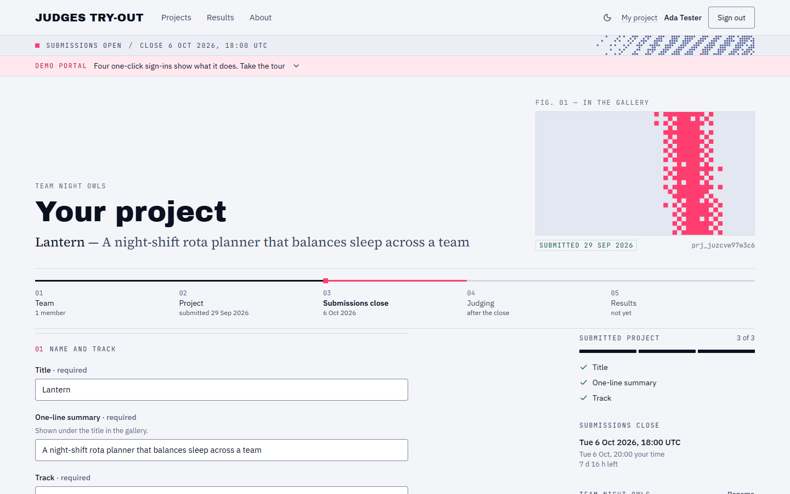
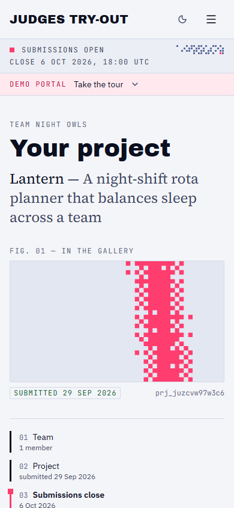

# Dogfood portal


A self-hostable hackathon submission and judging portal, built for Dogfood 2026. Organizers run an event, teams
hand in projects, judges score them and the community votes. Before anything is ranked, each judge's scores are
evened out for how lenient that judge is; every score, average and place can show how it was reached, and every
change lands in an append-only audit log.

- **Run it:** `docker compose up`, then `http://localhost:8080/sign-in` (below).
- **T1 and T2:** the organizers' `run.py`; its output is [`acceptance-report.txt`](acceptance-report.txt).
- **T3 and T4:** our hand check, `tests/isolation_check.py`; its output is [`isolation-report.txt`](isolation-report.txt).
  Both come from one clean run of the commit `isolation-report.txt` names (`acceptance-report.txt` is run.py's
  output as printed, so it names none; a report cannot name the commit that adds it); that commit changes only the
  reports.
  Every bullet, where it lives and how to check it: [Beyond the checker](#beyond-the-checker).
- **The judging engine:** [`JUDGING.md`](JUDGING.md), with the Monte Carlo that backs it (one command, below).
- **Built in the window:** the first commit is 2026-09-26 18:43 UTC, after the kickoff; the submission deadline the
  organizers announced in the event's Discord is 2026-09-29 18:00 UTC.

## Run it

1. `docker compose up`
2. Wait for `portal ready: http://localhost:8080/events/sample-hack-2026` (Next.js prints its own "Ready" a moment
   earlier, before the database is seeded and warmed up; the portal's line says how long that took).
3. Open `http://localhost:8080/sign-in` and pick a one-click demo identity: **Demo Organizer** (organizer and
   administrator), **Judge A** (Diego Herrera), **Judge B** (Jonas Vogel) or **priya1** (participant).

- No network is needed at run time; the image build downloads npm packages once.
- `docker compose down -v` resets everything.
- The start prints the four `Cookie: session=...` headers the acceptance checker uses; they are the same on every
  start.
- If port 8080 is taken, change the `ports` line in `docker-compose.yml` to `"127.0.0.1:8081:8080"` and
  `PUBLIC_URL` to `http://localhost:8081`, and give `run.py` and the hand check a copy of `.dogfood.toml` whose
  `base_url` says 8081.

The sample event is the organizers' `fixtures.json`, imported as given: its submissions closed on 1 March 2026 (the
checker needs a closed event), and all 41 projects carry the fixture's placeholder summary "One line of what it
does."

## A guided tour

About ten minutes, in this order; nothing needs a restart.

1. **Decisions.** Sign in as the organizer. The **Overview** lists the three decisions that stand between the
   sample event's scores and published results: a judge who scored every project 4 / 4 / 4, a project entered
   twice, a project with one counted review. Each shows its evidence. Leave them open for now.
2. **How the ranking is worked out.** **Results** (a preview until you publish) shows the ranking. Open any
   project for its receipt: each review, the judge's leniency, the arithmetic, the change from the raw mean and
   the score's margin of error (±). The **judge ledger** below gives every judge's leniency ± error and what
   leaving that judge out would move.
3. **Judging.** Sign in as Judge A: the keyboard-first console shows only Diego's own scores. Signed in as Judge B,
   `http://localhost:8080/api/judge/scores?judge=jdg_24` (Diego's) answers 403.
4. **Community vote.** It is open in demo mode for 30 days from the first start. Sign in as priya1 and pick up to
   three favourites at `/events/sample-hack-2026/vote`, or use the open link the start prints
   (`community vote (demo): ...`) in a private window. The organizer's **Voting** tab shows the count live; nobody
   else sees it until the vote closes. The rules: [`docs/FEATURES.md`, "Community vote"](docs/FEATURES.md#community-vote).
   - **Optional, before step 5: pairwise judging,** where judges answer "which is better?" instead of scoring.
     Choose it before you publish: once results are published the mode no longer changes. The steps:
     [`docs/FEATURES.md`, "Pairwise judging (optional)"](docs/FEATURES.md#pairwise-judging-optional).
5. **Publish.** On the Overview, settle the three decisions (keep the flat judge out, merge the duplicate, publish
   the thinly reviewed project as it is, with a reason). Each is one audited action, with a written reason
   wherever it overrides a rule. Tick the box and **Publish results**.
   - Publishing closes the community vote, so nobody votes with the judged ranking in view.
   - `/events/sample-hack-2026/results` now shows every place with its score ± error.
   - On **Results**, "Issue every record"; signed in as priya1, **My project** shows the team its reviews and a
     signed certificate, which `/verify` checks.
6. **The record.** **Audit log** lists every change and every refusal of a signed-in user (up to 60 refusals of
   one person in 10 minutes; past that they get 429 and no row: [`docs/FEATURES.md`, "Audit log"](docs/FEATURES.md#audit-log)),
   with the hash chain's head. **Integrations** has webhooks, the `fixtures.json` export and a link to your API
   tokens; `/api-docs` is the API reference.
7. **Hand in a project.** The sample event is closed on purpose, so try the participant side on an event of your
   own (about two minutes, and the sample event is untouched): as the organizer, **Your events**, **New event**,
   with a name, a close date in the future and one track. Sign out (the account menu, top right), open `/events/<its web address>`, **Take part**,
   create an account, **Start a team**, fill in the title and one-line summary, **Save draft**, then **Submit
   project**.

<p>


</p>

## Check it

```bash
python run.py .dogfood.toml                    # python3 on macOS
python tests/isolation_check.py .dogfood.toml  # our T3 and T4 hand check
npm ci && npm test                             # vitest, on Node 24 like the image
```

**T1 and T2.** `acceptance-report.txt` at the root is the output of the organizers' `run.py` against a clean
`docker compose down -v && docker compose up`. It reads `claimed T1 T2 T3 T4, verified T1 T2` and
`claimed but not verified: T3 T4`, because run.py checks T1 and T2 only.

**T3 and T4** are judged by hand (the organizers said so on their Discord, 2026-09-25), so we claim them on our own
check, which you can rerun: `tests/isolation_check.py`.

- `isolation-report.txt` is its output from a clean `docker compose down -v && docker compose up`, with the commit
  it ran on in its first lines; each of its lines starts with the check's number, the names used below.
- It writes votes and comments and publishes the sample event's results, so run it on a fresh portal, after
  run.py; it takes under a minute.
- What it needs, which checks were shown to fail on a planted defect, and the live webhook check:
  [`docs/HAND-CHECKS.md`, "Running the hand check"](docs/HAND-CHECKS.md#running-the-hand-check).
- Each T3 and T4 bullet, mapped to its checks: [Beyond the checker](#beyond-the-checker).

**Our own tests** (`npm test`; Node 24, since passwords use its built-in argon2) cover the permission rules, the
assignment engine, the normalization engine and its Monte Carlo validation, the pairwise engine and its proof,
voting and comments, the audit log's append-only triggers and hash chain, and the triggers that keep published
results final. `JUDGING.md`'s Monte Carlo table comes out of
`npx vitest run tests/normalization-mc.test.ts --silent=false` exactly as printed there (1,000 runs per scenario,
fixed seed; about 3 s of test time, 6 s in all, here); `--silent=false` is what makes vitest print it.

For developers, a check that nothing on screen jumps or shakes: [`docs/HAND-CHECKS.md`, "The stability check"](docs/HAND-CHECKS.md#the-stability-check).

## Beyond the checker

Every T3 and T4 bullet from the event site. All are built; the by-hand steps for each are in
[`docs/HAND-CHECKS.md`](docs/HAND-CHECKS.md).

| Tier | Bullet | Where | Checks in `isolation_check.py` |
|---|---|---|---|
| T3 | Community voting: email gated, link based or authenticated | Voting tab; `/events/<event>/vote`, `/vote/<code>` | B1, B3, B4, B6 |
| T3 | Project comments | Each project page; a hidden one shows its place and reason only to the organizers and its author | B8 |
| T3 | Results hidden during the voting window | Count `null` to all but organizers until it closes | B2, B5, B10, B11 |
| T3 | Randomized project ordering on ballots | Each voter's own seeded order | B4, B13 |
| T3 | Anti abuse: rate limits, duplicate detection, audit trail | Limits, flags on the Voting tab, audit log | B3, B5, B7, B9, B10, B12, B14, B15 |
| T4 | REST API and webhooks | `/api-docs`, `/api/openapi.json`; Integrations tab | C1 to C3, C10; `webhook_live_check.py` |
| T4 | Certificate and record generation | Results tab, "Issue every record"; `/records/<id>` | C4, C11 |
| T4 | Signed, publicly verifiable judge participation records | Ed25519; `/verify`; `scripts/verify-record.mjs` | C4, C5 |
| T4 | Embeddable gallery widget | `/embed.js`, `/embed/<event>` | C6 |
| T4 | Bulk import and export | CSV, `event.json`, `fixtures.json`; import on Your events | C7, C8, C12 |

## Where we deliberately differ

Choices made on purpose. Where a line says no mainstream platform does something, it means none of the hosted
platforms we checked describes it in its public documentation.

1. **Leniency is corrected, bounded and disclosed.** Each judge's tilt is estimated from the event's own scores and
   shrunk to what they support; none found, none corrected; every shift is on the receipts. No mainstream platform
   documents a correction across judges. ([`JUDGING.md`](JUDGING.md))
2. **Receipts on every score.** On the organizer's Results page each score shows its reviews, the leniency taken
   off, the arithmetic and its ±; teams see their own reviews, score and ±.
3. **The full ranking is published,** every project in every track with its score and ±, not only the
   winners. No mainstream platform documents publishing the whole ranking with its scores.
4. **Publishing freezes the judging.** It stores the exact run it publishes; the database then refuses to change a
   score or answer, or to withdraw or swap the results; the results page pins the audit entry they were published
   as, with its hash. Certificates and judging records are signed with Ed25519 (the results page itself is not).
5. **Open-link votes are counted apart,** in their own column, added to the result only if the organizer said so
   before the first ballot.
6. **An audit chain.** Every change and every refusal of someone the portal knows (up to 60 refusals of one
   person in 10 minutes, then 429 and no row), in the same transaction; the database refuses edits and deletes;
   each row carries the hash of the one before. No mainstream platform documents an audit trail.
7. **An API and webhooks for everything.** Every action in the interface is a JSON route, and every audited
   change can send a signed webhook, queued in the change's own transaction (the values of ballots, scores and
   pairwise answers stay in the portal). No mainstream platform documents a public API with webhooks.

## What it does

Each item in full, with its rules: [`docs/FEATURES.md`](docs/FEATURES.md).

- **Gallery:** every submitted project on its first page, searched by title, summary, write-up, team and tags,
  filtered by track and by tag, the filters kept in the link.
- **Events and teams:** dates, tracks, prizes, custom questions, a weighted rubric; teams by invite link; the
  organizer picks which project fields are required, optional or hidden; one-person events in one step.
- **Judging:** judges invited by link, a seeded and stored assignment run, a keyboard-first console with autosave,
  the judges who have not started in a view of their own with their reminders (to copy, or mailed with email on), the decisions that must be made
  before results go out, leniency correction with receipts and a judge ledger.
- **Pairwise judging (optional):** "which is better?" instead of scores, ranked by a Bradley-Terry fit.
- **Close calls:** a track whose first place the scores cannot name at 95 % says so, naming the close projects with
  their scores and ±; the organizer keeps the ranking's winner or records the judges' decision with a reason, shown on
  the public results and certificates beside the score order.
- **Finals (optional):** the top N of a track go to a panel of judges who score every finalist on the same rubric;
  the finalists then lead the track's published places, in the finals order (`JUDGING.md`, "Finals").
- **Results and exports:** publishing locked until every decision is made; public places per track, and every
  project in one order by score across tracks; exact score ties within a track joint, or broken by a rubric criterion
  the organizer chooses (said wherever it decides a place); CSV (scores, projects, assignments, ranking, pairwise
  answers, ballots with their picks sealed until the vote closes, comments, prize awards, finals, audit log) and `event.json`
  at every stage.
- **Prizes:** the organizer gives each prize to a project, or jointly to several, on the Results tab before
  publishing; final with the results, and shown on the public results, the winners' pages and their certificates.
- **Updates:** organizers post news to the event ("deadline extended", "winners at 18:00") in plain text; the
  newest three show on its Projects and About pages, every one on its Updates page; with email on, an update can
  also be mailed to the participants. Posting, editing and removing are audited, the old words kept.
- **Community vote and comments:** signed-in, voter-list or open-link voting; comments organizers can hide with a
  reason.
- **Signed certificates and judging records,** checkable in the browser, on `/verify` or offline.
- **API and webhooks** for every action; **import and export** in the organizers' fixture format.
- **Audit log:** append-only, hash-chained, readable by organizers and exportable as CSV.
- **Help:** a Help button in every top bar (or the `?` key) answers questions about the portal's pages, tasks and
  judging ideas from its own guide, matched in the browser, what the reader can do first; not an AI model.

How it is built: [`ARCHITECTURE.md`](ARCHITECTURE.md) (a request's path through the one permission check, the
audit log, boot, the API) and [`DATA-MODEL.md`](DATA-MODEL.md) (every table, its constraints and the personal data
it keeps). What the portal stops and what it does not: [`THREAT-MODEL.md`](THREAT-MODEL.md).

## Running it for a real event

On a fresh volume, set these in `docker-compose.yml` and start it:

```yaml
      SEED_CHECKER_SESSIONS: "false"
      FIXTURES_PATH: "none"
      ADMIN_EMAILS: "you@example.org"
      DOGFOOD_SEED_SECRET: "a long random string of your own"
      PUBLIC_URL: "https://hack.example.org"
```

The portal starts without the sample event and prints, in its own log, a one-time link:
`administrator setup: open https://hack.example.org/sign-up?setup=...`. Open it and sign up with the address in
`ADMIN_EMAILS`: that account is an administrator, and on **Your events** it creates your event or imports one.
Demo mode must be off wherever the portal can be reached: the checker's session tokens are public. The portal
refuses to start with the default secret unless it runs as the local demo (demo mode on, on a local address), so
with demo mode off it needs your own secret (`openssl rand -hex 32` makes one).

| Setting | In short |
|---|---|
| `SEED_CHECKER_SESSIONS` | Demo sign-ins and checker sessions; `"false"` for a real event |
| `DOGFOOD_SEED_SECRET` | Your own secret; keep it (it seals the signing key) |
| `PUBLIC_URL` | The address people use; set it before issuing records |
| `SMTP_URL`, `MAIL_FROM` | Email, off by default |
| `COOKIE_SECURE` | `Secure` cookies; automatic for an `https://` `PUBLIC_URL` |
| `TRUST_PROXY_HOPS` | Reverse proxies in front, for the client's address |
| `SIGN_IN_LIMIT_PER_ADDRESS` | Sign-ins per address in 10 minutes; default 300 |
| `SESSION_DAYS` | How long a sign-in lasts; default 14 |
| `WEBHOOKS_ALLOW_PRIVATE` | Lets webhooks reach local addresses |
| `ADMIN_EMAILS` | The portal's administrators |
| `DATABASE_PATH`, `FIXTURES_PATH` | Where the database lives; which fixture file to import |

Each setting in full, accounts and password resets, health checks, backup and restore, and upgrading:
[`docs/OPERATIONS.md`](docs/OPERATIONS.md).

People's data: the portal's `/privacy` page lists everything it keeps about the people who use it, how long and
what removes it. It deletes ended sessions and idle rate-limit buckets by itself every hour; the mail log, finished
webhook deliveries and the voters' address hashes are yours to clear with `scripts/purge.mjs`
([`docs/OPERATIONS.md`, "Personal data"](docs/OPERATIONS.md#personal-data)).

## What it does not do yet

- **Gallery pages.** The gallery has none: every submitted project is on its first page (the organizers' checker
  reads them all from the first paint), with the search, track and tag filters to narrow it.
- **Uploads.** Images only: a project's picture and up to 6 gallery images (PNG, JPEG or WebP up to 8 MB each,
  redrawn as a WebP without metadata such as a photo's location; an organizer can take any of them down). A demo
  video or a slide deck is a link.
- **Webhook secrets** are kept in the database as they are, because the portal signs with them. Webhook targets on
  private or local addresses are refused when added and at every delivery, on the very addresses the delivery
  connects to, so a DNS answer that changes after the check cannot slip through; `WEBHOOKS_ALLOW_PRIVATE=true`
  lifts that for a receiver on your own network.
- **Email** leaves out the administrator's setup link (the link stays in the log). It mails a judge's reminder
  only when an organizer asks, at most once an hour per judge; it has no reminder schedule of its own.
- **Accounts are not email-verified,** so an invitation addressed to someone with no account yet can be taken by
  whoever holds its link and signs up with that address first; the Judges page names the account that accepted
  each invitation.
- **Password resets and personal links.** A forgotten password is reset only by a portal administrator's one-time link, never by an event's organizer. An
  organizer's personal links for imported people, and making someone a co-organizer, reach only people who hold
  no role and no team seat in any event that organizer does not run (checked again when a link is used), so one
  event's organizer cannot take over accounts that matter in another.
- **Shared network addresses.** The per-address limits (open-link entries, which the organizer can raise for a venue; sign-ups and sign-ins,
  which the operator can) and the duplicate-ballot flags key on the client's network address, so people behind
  one address (an office, a venue's wifi) share a limit.
- **Results cannot be unpublished.**
- **Help is not an AI model.** It finds pages and answers only in the portal's own guide (`src/lib/help/index.ts`) by
  matching words; a question the guide does not cover gets "no match" and the main places, never a guess.
- **One person cannot be erased:** nothing in the portal deletes an account, and a judge's started reviews, the audit
  log's entries and signed records stay for good (published scores are final and the audit log is append-only).
  What the operator can clear, and how: [`docs/OPERATIONS.md`, "Personal data"](docs/OPERATIONS.md#personal-data).
- **Teams.** A team is never left with nobody: its last member cannot leave, and an organizer cannot take them off. A team
  with a submitted project cannot be dissolved, so someone who handed in alone under the wrong team stays on it;
  the organizers can add them to the right team only after taking them off this one, which needs another member
  on it first.
- **Organizers are trusted with their own event:** nothing stops an organizer from also being on a team in it. The
  portal logs every organizer decision (a judge left out or reinstated, a merge, a project published as it is, an
  assignment taken back, a recusal undone, a project moved to another track, a judge removed, a finalist added or
  taken off against the ranking, finals closed early, publishing) with its reason, where co-organizers can read it.
- **Three or more copies.** A team that entered the same project three or more times: the overview merges two copies; merge the others over
  the API (`POST /api/events/<event>/duplicates/merge`).
- **Moving an event.** An event's `fixtures.json` imported on another portal as a new event leaves behind its
  drafts, open judge assignments and recusals, pending invitations, co-organizers, signed records (the new portal
  signs its own) and its audit log (the new one starts at the import's entry; keep the old `audit.csv`). Ballots
  move only once voting has closed, and the old portal's voting links open nothing on the new one. See
  [`docs/OPERATIONS.md`](docs/OPERATIONS.md#moving-an-event-to-another-portal).
- **Signed records cannot be revoked,** and the signing key cannot be rotated from the interface (a new
  `DOGFOOD_SEED_SECRET` makes the next start use a new one); a record keeps what was true when it was issued.
- **No calibrated prize probabilities or rank intervals:** normalized ranks compare within a track, and close scores
  should be read as ties. A close call says only whether the scores name the first place at the validated 95 % line,
  and which projects are too close, never a chance of being first (JUDGING.md, "Close calls"). Pairwise mode gives
  each place its chance of being ahead of the next one, not a full interval, and has no close calls.
- **Rubric level texts.** The three default criteria (Functionality, Quality, Innovation) come with a short text for
  each score, for example "Works, a few rough edges" for a 4, which the judge console shows; the Rubric tab cannot
  edit them yet. A criterion the organizer adds shows only the numbers, and a renamed default keeps its old texts.
- **No finals round and no disqualification.** A track's places come from its one round of scores, with the
  tie-break on exact ties and the judges' decision on a close call; there is no second round for the top projects
  and no way to take a project out of the places for breaking the rules.
- **Tactical pairwise answers.** Pairwise mode flags a judge who answers like a coin flip, but not one who calls "too close to call" whenever a
  favourite would lose (flagged in 14 of 120 simulated panels; the ties bought the favourite 0.258 places on
  average, at most 3; `THREAT-MODEL.md`, "Tactical pairwise answers").

## Licence

MIT, see `LICENSE`. The fonts in `src/fonts/` are under the SIL Open Font License 1.1; each licence sits next to
its font.
